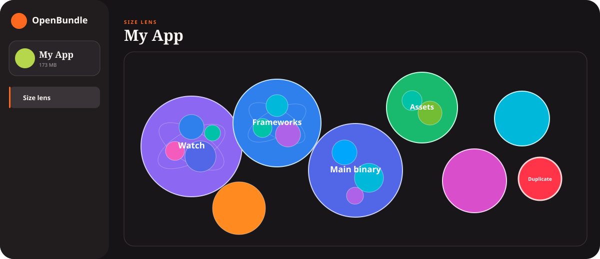

# OpenBundle

OpenBundle is a private, local iOS bundle-size analyzer. Give it an `.ipa`,
`.app`, or `.xcarchive`; it writes a single interactive HTML file with a
circle-packed Size Lens and prioritized Quick Wins.

Nothing is uploaded. The report has no CDN, analytics, external JavaScript, or
server dependency.



## Quick start

Requirements: macOS, Python 3.11+, and ideally Xcode/Command Line Tools.

```bash
# No installation needed
./openbundle ~/Downloads/MyApp.ipa --open

# Archives give OpenBundle access to any top-level Linkmaps directory
./openbundle ~/Library/Developer/Xcode/Archives/.../MyApp.xcarchive \
  --output ./my-app-size.html \
  --json
```

The command prints the report’s full local path. `--open` opens that local file
in your default browser. Use `./openbundle --help` for all options.

You can also install the command in an isolated environment:

```bash
python3 -m pip install -e .
openbundle analyze MyApp.ipa --open
```

## What the report does

### Size Lens

- Sizes every file and nested bundle, framework, extension, and resource.
- Packs the current region into non-overlapping circles using logarithmically
  compressed area weighting, so dominant binaries stay dominant without
  reducing small files to unreadable dots.
- Treats each parent like an atom: faint orbital shells reveal its largest
  child particles, hover exposes their labels, and one continuous microscope
  transition opens the next level. The back button and breadcrumb return to
  earlier levels.
- Searches file paths, framework names, asset names, Mach-O sections, and
  Linkmap compile units.
- Switches between uncompressed bundle bytes, compressed download estimate,
  and 4 KB filesystem allocation estimate.
- Uses a vivid category and Mach-O-section palette inspired by Jacob’s Tech
  Tavern, while reserving red exclusively for exact duplicates.
- Colors exact duplicate files, asset renditions, and complete embedded
  components red; other findings use amber dots.

When Apple’s `assetutil` is installed, `Assets.car` is expanded into named
assets using its `SizeOnDisk` and digest metadata. Mach-O binaries are expanded
into architectures, segments, and sections. For `.xcarchive` inputs containing
a top-level `Linkmaps` directory, compile-unit attribution replaces the section
view where a matching link map is found.

### Current checks

| Check | How OpenBundle evaluates it |
| --- | --- |
| Exact duplicate files | SHA-256 and byte size; keeps one copy in the saving estimate |
| Duplicate catalog renditions | `assetutil` digest and on-disk rendition size |
| Duplicate embedded components | Fingerprints complete frameworks, bundles, extensions, and nested apps while ignoring signing-only files |
| Image compression / HEIC | Non-destructive local `sips` conversion at quality 85; flags savings over 4 KB |
| Very high-resolution images | Pixel dimensions from `sips`, with a review threshold of 3,000 px |
| Alternate app icon detail | Uses `CFBundleAlternateIcons`, then simulates a 180 px downscale and required 1024 px export |
| Binary symbol stripping | Runs `strip -rSTx` against a temporary output and compares byte size; never modifies the app |
| Release coverage instrumentation | Measures `__LLVM_COV`, `__llvm_prf*`, and `__llvm_cov*` payloads that should normally not ship |
| Legacy embedded bitcode | Measures `__LLVM` segments left by older build settings or prebuilt dependencies |
| Unnecessary files | Headers, module interfaces, source, scripts, docs, build settings, symbol maps, and related build-time files |
| Embedded provisioning | Reports profile bytes as review-only because device/ad hoc builds may require them |
| Small-file overhead | 4 KB allocation slack for loose files, plus guidance about code-signature entries |
| Loose image scales | Groups `@1x`/`@2x`/`@3x` files that miss asset-catalog thinning |
| Dynamic frameworks | Counts embedded dynamic images and estimates segment page-alignment slack |
| Simulator architectures | Finds x86/i386 or simulator slices in fat distribution binaries |
| Localization minification | Finds binary `.strings` plists and removable translator comments |
| Target-membership mistakes | Highlights repeated large `Assets.car` files in frameworks/extensions |
| Dependency product sprawl | Groups modular AWS, Amplify, Firebase, Google, Stripe, and Twilio frameworks for manual audit |
| Debug/test dependencies | Name-based check for common test, injection, and inspection frameworks |
| Bundled media | Large video/audio review with bitrate and on-demand delivery guidance |
| Lottie repetition | Exact file duplication plus a conservative structure-similarity heuristic |
| Illustration-like SVGs | Finds large, path-heavy, or raster-embedding SVGs for raster comparison |

Savings marked **high confidence** are derived from exact bytes or an actual
temporary tool simulation. **Review** findings deliberately show no saving when
the artifact cannot prove that a resource or module is unused.

## Why these checks

Emerge documented X-Ray as a zoomable, searchable treemap that expands asset
catalogs and binaries, with duplicates and unnecessary files colored red:
[X-Ray documentation](https://docs.emergetools.com/docs/treemap).

Its public iOS size-insight set included:

- [Duplicate hashing across files and asset catalogs](https://docs.emergetools.com/docs/remove-duplicates)
- [Quality-85 image recompression and HEIC conversion above a 4 KB threshold](https://docs.emergetools.com/docs/optimize-images)
- [Production Swift/local symbol stripping, with the important dSYM warning](https://docs.emergetools.com/docs/strip-binary-symbols)
- [UTF-8 localized strings and removal of production translator comments](https://docs.emergetools.com/docs/minify-localized-strings)
- [Build-time and informational files that should not ship](https://docs.emergetools.com/docs/unnecessary-files)
- [Code-signature and filesystem overhead from many small files](https://docs.emergetools.com/docs/avoid-many-files)
- [Asset catalogs for thinning loose scales and packing data](https://docs.emergetools.com/docs/use-asset-catalogs)
- [Dynamic-framework page overhead and the static-linking trade-off](https://docs.emergetools.com/docs/unmapped-size)
- [Oversized alternate icons](https://docs.emergetools.com/docs/optimize-icons)
- [Protocols with no conforming type in the binary](https://docs.emergetools.com/docs/unused-protocols)

OpenBundle implements the artifact checks that can be reproduced safely and
locally with Apple tooling, then adds practical audits for bundled media,
modular SDKs, target membership, Lottie, and detailed illustrations.

Apple’s current guidance also recommends checking Release optimization and
stripping settings, removing unused assets, using asset catalogs, and moving
payload data out of source code:
[basic app-size optimization](https://developer.apple.com/documentation/xcode/doing-basic-optimization-to-reduce-your-app-s-size).
The reflection review follows Apple’s documented
[`SWIFT_REFLECTION_METADATA_LEVEL`](https://developer.apple.com/documentation/xcode/build-settings-reference)
trade-offs and is deliberately never presented as guaranteed savings.

### Quick Wins

The report keeps measured savings separate from review items and gives every
finding one short next step. In addition to the byte-saving checks above, it
flags oversized embedded targets, missing Link Maps, large embedded asset
catalogs, Swift reflection names, payload-like strings compiled into binaries,
and aggregate bundled video/audio.

## Static libraries versus dynamic frameworks

A small source module can become a surprisingly large dynamic framework because
the complete product, signing metadata, load commands, Swift runtime metadata,
and page-aligned Mach-O segments are shipped. A static linker can often pull
only referenced object files into the app executable. That is why conversions
can sometimes resemble “8.3 MB dynamic” versus “0.8 MB static.”

It is not a universal rule:

- Static code can be duplicated into the main app and multiple extensions.
- Some vendor products support only dynamic embedding.
- Objective-C categories and linker flags such as `-ObjC` can change what is
  pulled from a static archive.
- A dynamic framework can be the correct boundary for genuinely shared runtime
  code.

OpenBundle therefore reports the measured dynamic frameworks and alignment
estimate, but marks the conversion as **Review**. Rebuild and compare the
exported IPA before accepting the change.

## What a shipped artifact cannot prove

OpenBundle does **not** label arbitrary source code or SDK products “dead.” A
Mach-O file alone cannot reliably prove runtime reachability through reflection,
Objective-C selectors, dependency injection, plug-in lookup, or feature flags.
Similarly, a protocol with no emitted conformance can still appear in a dynamic
cast.

For dead-code work:

1. Enable `DEAD_CODE_STRIPPING = YES` in Release.
2. Archive with Linkmaps to attribute remaining bytes to compile units.
3. Combine static reachability with production-like runtime coverage.
4. Delete code in small, testable changes and compare exported IPAs.

The exact App Store download number also requires Apple’s thinning and
compression pipeline. OpenBundle shows IPA compressed entries when given an
IPA, and a per-file deflate estimate for `.app`/`.xcarchive` inputs.

## Linkmap layout

OpenBundle recognizes Emerge’s documented archive layout:

```text
MyApp.xcarchive/
  Products/Applications/MyApp.app/
  dSYMs/
  Linkmaps/
    MyApp-LinkMap-normal-arm64.txt
```

In Xcode, set **Write Link Map File** to `YES`, then copy the Release link maps
into the archive’s top-level `Linkmaps` folder as part of your archive process.

## Development

```bash
python3 -m unittest discover -s tests -v
PYTHONPATH=src python3 -m py_compile src/openbundle/*.py
```

The analyzer uses only the Python standard library. Apple tools are optional:
without `assetutil`, `sips`, or `strip`, the base Size Lens and the remaining
checks still work and the report records the missing capability.
